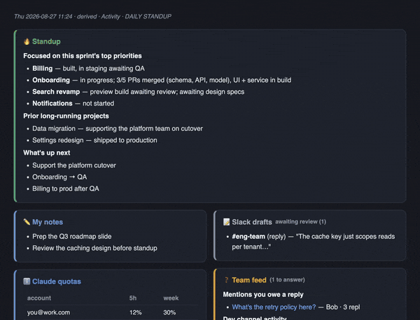
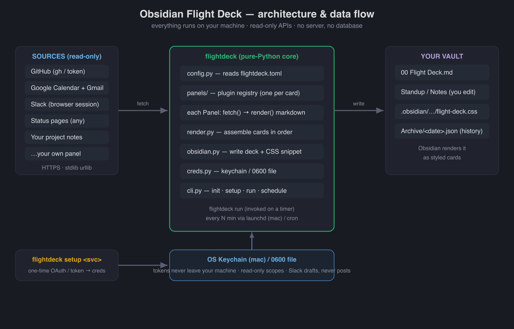

<div align="center">

# 🛫 Obsidian Flight Deck

### Your whole day on one Obsidian page — generated from your real dev tools.

*Standup, PRs shipped & in flight, who you're waiting on, today's calendar, the email that actually
needs you, unsent Slack drafts, and service status — assembled automatically and refreshed every few
minutes. No server. No database. Runs entirely on your machine.*

[](https://github.com/jgrichardson/obsidian-flight-deck/actions/workflows/ci.yml)
[](https://www.python.org)
[](#design)
[](LICENSE)
[](CONTRIBUTING.md)



</div>

---

## Why

You already have a dozen tabs open to answer one question — *what should I be doing, and what's
blocking me?* Flight Deck answers it in one glance, in the notes app you already keep open. It reads
your live tools and writes a clean, card-based page into your Obsidian vault. You read it; you never
maintain it.

- **One glance, not twelve tabs.** GitHub, calendar, email, Slack, and status pages, unified.
- **Standup writes itself.** A curated standup card you shape once and edit inline.
- **Yours, on your machine.** Read-only scopes, credentials in your OS keychain, nothing phones home.
- **Extensible by design.** Every panel is optional, reorderable, and ~30 lines to add your own.

## Panels

| Panel | Shows | Needs |
|---|---|---|
| **Standup** | An editable note you curate — embedded live | — |
| **My notes** | A scratch pad, editable beside the deck | — |
| **Tech progress** | Last-24h PR metrics + merged / in-progress tables, tagged by project | GitHub |
| **Waiting on** | Who owes you, scanned from your project notes | — |
| **System status** | Any [Statuspage](https://www.atlassian.com/software/statuspage) service — GitHub, your own, anything | — |
| **Calendar** | Today's events + invites to answer, one click to the event | Google (read-only) |
| **Email — needs you** | Unread person-to-person mail, newsletters filtered out | Google (read-only) |
| **Slack drafts** | Your unsent drafts — **read + draft only, never posts** | Slack |
| **Decile Base** | Mentions you owe a reply, plus a channel activity digest | Claude Code `decilehub` MCP |
| **Claude quotas** | 5h/weekly usage % per account | A statusline script caching to `~/.claude/usage-cache/` — see `docs/CLAUDE_QUOTAS.md` |
| **Detected activity** | PR/merge mentions found in your own Claude Code session transcripts, resolved to real PR titles; one click files one as a standup bullet | Nothing — reads `~/.claude/projects/*/*.jsonl`, already on disk |

Pick the ones you want, in the order you want, in one config file. Add your own in minutes.

## Quickstart

```bash
pip install obsidian-flight-deck        # or: pipx install obsidian-flight-deck
flightdeck init                         # writes ~/.config/flightdeck/flightdeck.toml
$EDITOR ~/.config/flightdeck/flightdeck.toml    # set your vault path + repos
flightdeck setup github                 # reuses the `gh` CLI, or paste a token
flightdeck run                          # builds the deck into your vault
flightdeck install-schedule             # auto-refresh every few minutes (launchd / cron)
```

Open the deck note in Obsidian (**Reading view**). That's it. Add the optional integrations whenever:

```bash
flightdeck setup google                 # read-only Calendar + Gmail (5-min one-time OAuth)
flightdeck setup slack                  # browser-session tokens — no app, no admin approval
flightdeck doctor                       # verify config + connections
```

Full auth walkthroughs (including the 5-minute Google setup and the two Slack values): **[docs/AUTH.md](docs/AUTH.md)**.

## Configuration

One file, `flightdeck.toml`. Panels are an ordered list — reorder or delete freely.

```toml
[vault]
path = "~/Obsidian/MyVault"

[[panels]]
name = "status"
[[panels.services]]                     # add ANY status page, no code
label = "GitHub"
url   = "https://www.githubstatus.com"
[[panels.services]]
label = "My API"
url   = "https://status.mycompany.com"

[[panels]]
name = "github_prs"
repos = ["my-org/app", "my-org/infra"]
active_projects = ["Billing", "Onboarding"]     # optional; else every label shows
[panels.github_prs.project_labels]              # optional regex → project name
"bill|invoice" = "Billing"
```

See [`flightdeck.example.toml`](flightdeck.example.toml) for every option.

## Architecture

<div align="center"></div>

One `flightdeck run` (fired on a timer) fetches from your configured sources over **read-only
HTTPS**, each enabled **panel** renders its markdown, and the assembled deck is written into your
Obsidian vault. Credentials live in your OS keychain; nothing is sent anywhere but the APIs you set up.

## Extending it

- **Add a status endpoint** → one more `[[panels.services]]` line. No code.
- **Add repos / project mapping** → edit the `github_prs` options. No code.
- **Add a whole new panel** → subclass `Panel`, implement `render()`, register it. ~30 lines.
  Guide: **[docs/PANELS.md](docs/PANELS.md)**.

## Design

- **Zero dependencies.** Pure Python standard library. Config is TOML (`tomllib`). Installs in seconds.
- **Everything derived.** The deck is regenerated each run — you never hand-edit it. The only
  hand-edited inputs are the notes you embed (Standup, My notes).
- **Read-only by default.** Google and Slack use read-only scopes; the Slack integration can create
  drafts but **cannot post**.
- **On your machine.** Secrets go in your OS keychain (macOS) or a `0600` file. No telemetry, no cloud.

## FAQ

**Does it work without Obsidian?** It writes a Markdown file — Obsidian just renders it beautifully.
Any Markdown viewer shows the content; the card styling is Obsidian-specific.

**Is my data safe?** Nothing leaves your machine except calls to the APIs you configure, all read-only
by default. See [SECURITY.md](SECURITY.md).

**Two-column / grid layout?** Yes, with the free [Multi-Column Markdown](https://github.com/ckRobinson/multi-column-markdown)
Obsidian plugin (Reading view). Single-column works with no plugins.

**Windows / Linux?** The core is cross-platform; the keychain and scheduler paths are macOS-first
today, with a cron fallback and a file-based credential store elsewhere. Contributions welcome.

**Only GitHub and Google and Slack?** Those ship built-in. The status panel already takes *any*
Statuspage service, and a new source is a ~30-line panel — see [docs/PANELS.md](docs/PANELS.md).

## Roadmap

- More built-in panels (CI runs, incidents, on-call, PR review queue).
- Optional web export — share a redacted view (great for a manager or teammate).
- Optional **AI layer** (harness-agnostic): compose the standup and answer questions over your deck's
  history — pluggable across Claude, Codex, or any CLI you already use. See [the plan](docs/ROADMAP-AI-LAYER.md).
- First-class Windows/Linux support.

## Contributing

Small, dependency-free, and easy to hack on. See **[CONTRIBUTING.md](CONTRIBUTING.md)** and the
[good first issues](https://github.com/jgrichardson/obsidian-flight-deck/labels/good%20first%20issue).
Star the repo if it's useful — it genuinely helps. ⭐

## License

[MIT](LICENSE).
